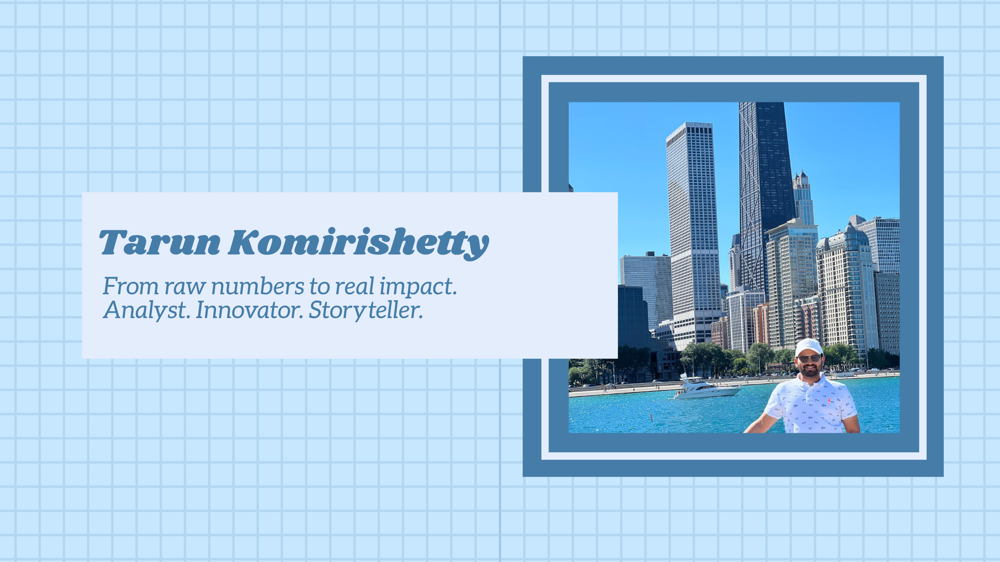

<link rel="icon" type="image/x-icon" href="assets/img/favicon.ico">
<link rel="stylesheet" href="assets/css/custom.css">

# 👋 Hi, I'm Tarun Komirishetty

🎯 **Data Analyst | Analytics Engineer | Machine Learning Enthusiast**  
📍 Based in Chantilly, VA | 📧 tkomiris@gmail.com

---

## 🚀 About Me

I'm a Data Analyst with over 3 years of experience driving data-informed decisions in enterprise and B2B environments. I specialize in automating reporting pipelines, building scalable dashboards, and translating complex data into actionable business insights.

Currently at **CARFAX**, I’ve built KPI dashboards, ML models for vehicle classification, and automated reporting that saves hundreds of hours annually.

---

## 🛠️ Skills & Tools

  <ul>
    <li><strong>Languages:</strong> Python, R, SQL, MATLAB</li>
    <li><strong>Data Tools:</strong> Tableau, Power BI, Salesforce</li>
  </ul>
  <ul>
    <li><strong>Databases:</strong> Redshift, Oracle, Excel, Access</li>
    <li><strong>Statistical Modeling:</strong> Regression, ANOVA, Hypothesis Testing</li>
  </ul>

---

## 📚 Education

**George Mason University**  
*MS in Analytics Engineering (GPA 4.0)*  
📘 Courses: Applied ML, Predictive Analytics, NLP with Deep Learning

---

## 💼 Experience Highlights

**CARFAX – Associate Data Analyst**  
- Automated R-based reports (25% manual effort saved)  
- Created Shiny dashboards on Salesforce (freed up 1 FTE)  
- Built a vehicle trim ML model (improved accuracy by 30%)

**Accenture – Data Analyst**  
- Designed Power BI dashboards to optimize supply chain  
- Led a 5-member team automating validation workflows (60% faster reporting)

---

## 🧪 Featured Projects

- 🔍 **[Vehicle Trim Detection](#)** – ML model for internal data accuracy  
- 🧠 **[NER Pipeline](#)** – Custom Named Entity Recognition with GRU/LSTM  
- 📊 **[KPI Dashboards](#)** – Scalable BI dashboards using Tableau and QuickSight

---

## 📫 Connect With Me

  <a href="mailto:tkomiris@gmail.com?subject=Let's%20Connect&body=Hi%20Tarun%2C%0AI%20came%20across%20your%20portfolio%20and%20wanted%20to%20reach%20out..."
     style="display:inline-block; background:#007acc; color:white; padding:8px 14px; border-radius:5px; text-decoration:none; font-weight:500;">
     📧 Email Me
  </a>
  <a href="https://www.linkedin.com/in/tarun-komirishetty-b8b722218"
     style="display:inline-block; background:#006699; color:white; padding:8px 14px; border-radius:5px; text-decoration:none; font-weight:500; margin-right: 10px;">
     🔗 LinkedIn
  </a>
  <a href="projects"
     style="display:inline-block; background:#444; color:white; padding:8px 14px; border-radius:5px; text-decoration:none; font-weight:500;">
     📁 View Projects
  </a>

---
